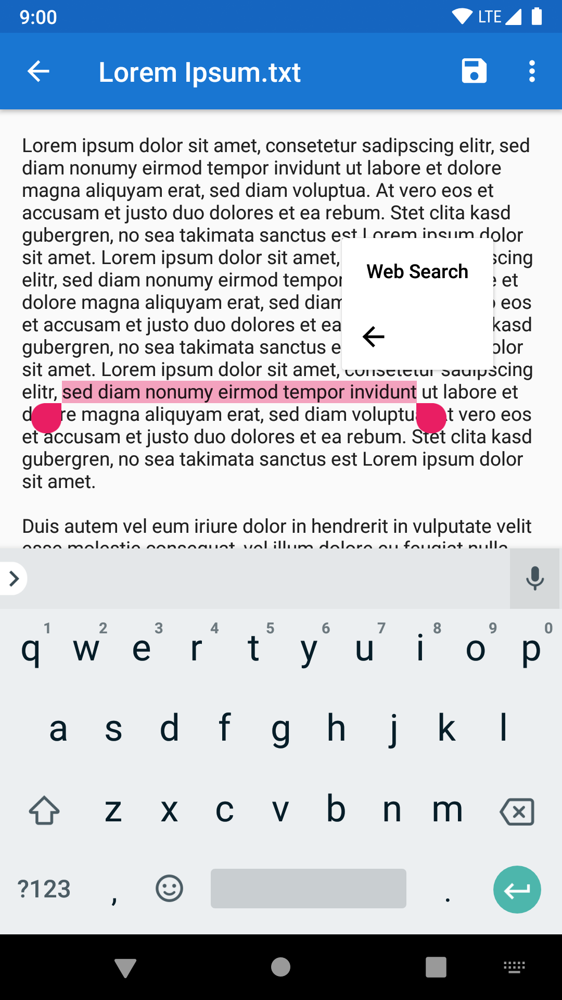
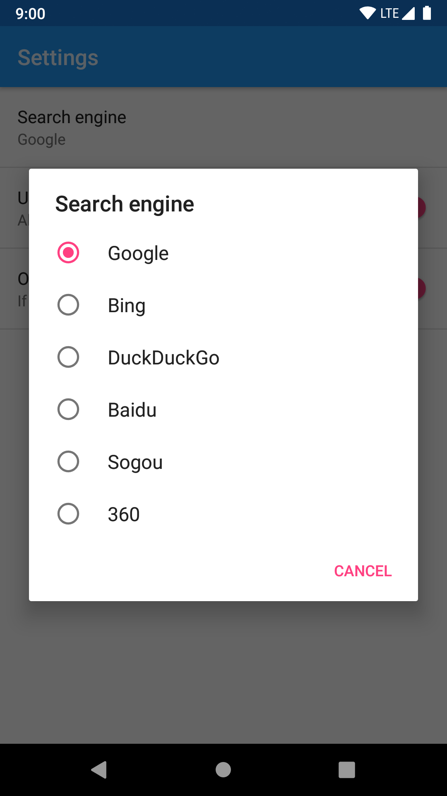

# Select Text to Search

This tiny app can add a "Web search" action to the text selection toolbar on Android.

It also adds a "Web search" as target for sharing text. The default search engine can be configured in its settings page, openable in Custom Tabs toolbar, or the App info page for this app in system Settings.

Text selection toolbar requires Android Marshmallow or above, so this app requires it as well.

Download: [Google Play](https://play.google.com/store/apps/details?id=me.zhanghai.android.textselectionwebsearch), Coolapk (TODO), [APK](https://github.com/zhanghai/TextSelectionWebSearch/releases/download/v1.0.1/app-release.apk)

## Preview

  

## License

    Copyright (C) 2018 Hai Zhang

    This program is free software: you can redistribute it and/or modify
    it under the terms of the GNU General Public License as published by
    the Free Software Foundation, either version 3 of the License, or
    (at your option) any later version.

    This program is distributed in the hope that it will be useful,
    but WITHOUT ANY WARRANTY; without even the implied warranty of
    MERCHANTABILITY or FITNESS FOR A PARTICULAR PURPOSE.  See the
    GNU General Public License for more details.

    You should have received a copy of the GNU General Public License
    along with this program.  If not, see <https://www.gnu.org/licenses/>.
